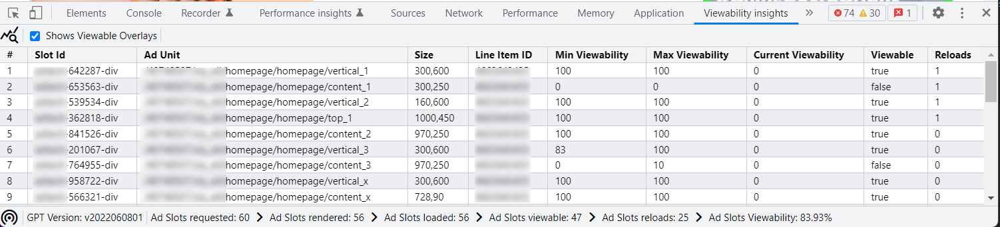
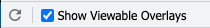

# Ad Manager Viewability Insights 🚀

[](https://chrome.google.com/webstore/detail/ad-manager-viewability-insights/ahnljpdlfbmbhfabicjhfpaahfpedgfn)

Ad Manager Viewability Insights is a open-source Dev Tools extension to help to improving the viewability and quality of fixed and dynamic ad slots of webpages.



This tool is a extension for the [Chrome DevTools](https://developer.chrome.com/docs/devtools/), an set of web developer tools built directly into the Google Chrome browser.

🧪 We are currently in beta and still in the development process. In order to help us improve please [file an issue](https://github.com/googleads/googleads-viewability-insights-extension/issues) to let us know of any issues or suggestions you may have.

⚠️ Ad Manager Viewability Insights results aren't an indication of compliance or non-compliance with any Google Publisher Policies.

##  Chrome DevTools Extension

### ⚙️ Install from Chrome Store

If you only want to install the **Ad Manager Viewability Insights**, please use the
pre-compiled version from the Chrome Store.

1. Visit the [Chrome Web Store][chrome_store]
2. Click **Add to Chrome**

### 🛠️ Build the **Ad Manager Viewability Insights** from source

In the case you want to build the **Ad Manager Viewability Insights** from source, you need to run the following [Node.js][node.js] commands within the directory:

```sh
npm install
npm run build
```

Afterwards load the **dist** folder in your Chrome browser as locale extension folder.

## ⚗️ Usage

**Run it:** Open the Chrome DevTools, select the **Viewability insights** panel.


1. Click the reload button  to record the page load.
2. Get an overview of all ad slots, their sizes and their current viewability.
3. Navigate throw the page to understand when an ad slots is considered as viewable.
4. Identify improvements to your viewability, by the overview and the visualization on the page.

### 🧰 Toolbar

The toolbar allows you to reload the page and to enable / disable the viewable overlays on the webpage.



#### Not viewable ad slot

Currently not viewable ad slots are rendered with a red border and will show the following overlay on mouse over.


#### Viewable ad slot

As soon a ad slots is considered as viewable it will be rendered with a green border and will show the following overlay on mouse over.


### 📊 Viewability Insights Report

The report will provide you a detail overview about each single ad slot.


- **Slot Id**: The ID of the slot div provided when the slot was defined.
- **Ad Unit**: The full path of the ad unit, with the network code and ad unit path.
- **Size**: Indicates the pixel size of the rendered creative.
- **Line Item Id**: Line item ID of the rendered reservation or backfill ad.
- **Min Viewability**: Min. detected viewability before the slot became viewable.
- **Max Viewability**: Max. detected viewability of the slot.
- **Current Viewability**: The current on-screen percentage of an ad slot's area. The event is throttled and will not fire more often than once every 200ms.
- **Viewable**: Is the slot viewable, according to the [Active View criteria](https://support.google.com/admanager/answer/4524488).
- **Reloads**: Number of detected reloads of the slot.

### 🔎 Status Bar

The status bar will provide some general information about the ad slots on the page.


- **Ad Slots requested:** This event is fired when an ad has been requested for a particular slot.
- **Ad Slots rendered:** This event is fired when the creative code is injected into a slot and will occur before the creative's resources are fetched, so the creative may not be visible yet.
- **Ad Slots loaded:** This event is fired when the creative's iframe fires its load event. When rendering rich media ads in sync rendering mode, no iframe is used so no SlotOnloadEvent will be fired.
- **Ad Slots viewable:** This event is fired when an impression becomes viewable, according to the [Active View criteria](https://support.google.com/admanager/answer/4524488).
- **Ad Slots reloaded:** This event is fired when an already known slots gets destroyed or reloaded.
- **Ad Slots viewability:** This shows the overall percent of loaded ad slots to viewable ad slots.

## 📜 Licensing

Apache License, Version 2.0 see [LICENSE.md](LICENSE.md)

## 🐛 Report Issues

For any issues or feature requests, we would really appreciate it if you report
them using our [issue tracker](https://github.com/googleads/googleads-viewability-insights-extension/issues).

## 🤝 Contributing

Contributing to this project is subject to the guidelines in the
[CONTRIBUTING.md](CONTRIBUTING.md) file, which, in brief, requires that
contributors sign the [Individual Contributor License Agreement (CLA)][cla].

[cla]: https://cla.developers.google.com/
[chrome_store]: https://chrome.google.com/webstore/detail/ad-manager-viewability-insights/ahnljpdlfbmbhfabicjhfpaahfpedgfn
[node.js]: https://nodejs.org/en/
